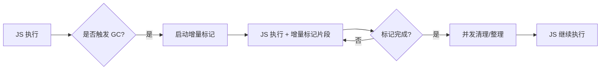

分代垃圾回收（Generational Garbage Collection）本身并不能完全避免长时间停顿，但现代 JavaScript 引擎（如 V8 的 **Orinoco GC**）通过一系列**并发（concurrent）、并行（parallel）、增量（incremental）和惰性（lazy）技术**，将原本可能长达数百毫秒的“Stop-The-World”（STW）停顿**拆解为多个微小停顿**，从而显著降低用户可感知的卡顿。

下面我们从 **问题根源、核心策略、V8 实现细节** 三个层面详解如何避免长时间停顿。

---

## 一、为什么传统 GC 会导致长时间停顿？

在早期 GC 中（如标记-清除），必须：

1. **暂停所有 JS 执行**（Stop-The-World）；
2. 遍历整个堆，标记所有可达对象；
3. 清理不可达对象。

当堆很大（如 1GB）时，这个过程可能需要 **100ms~500ms**，导致页面卡死、动画掉帧。

> 🎯 目标：**将单次长停顿 → 多次短停顿（< 1ms~2ms）**

---

## 二、V8 的四大核心技术：拆解停顿

### 1. **分代回收（Generational Collection）** —— 减少扫描范围

- **新生代（Young Generation）**：
  - 对象生命周期短，90%+ 在第一次 GC 就死亡；
  - 使用 **Scavenge 算法（Cheney 复制）**，只处理少量存活对象；
  - **停顿时间极短（通常 < 1ms）**。

- **老生代（Old Generation）**：
  - 只有长期存活对象才进入；
  - GC 频率低（几秒一次）；
  - 即使全堆扫描，也比每次都扫整个堆快得多。

✅ **效果**：大部分 GC 停顿来自新生代，非常轻量。

---

### 2. **增量标记（Incremental Marking）** —— 拆分标记阶段

#### ❌ 传统方式：

- 一次性标记整个老生代 → 长时间 STW。

#### ✅ V8 的增量标记：

- 将**标记阶段**拆分为多个小步骤；
- 每次 JS 执行一段后，**穿插一小段标记工作**；
- 使用 **写屏障（Write Barrier）** 跟踪标记期间的对象修改。

##### 工作流程：

```text
JS 执行 → 暂停 0.5ms 做标记 → JS 执行 → 暂停 0.5ms 做标记 → ... → 标记完成
```

- 总标记时间不变，但**最大停顿时间大幅降低**；
- 用户几乎感知不到卡顿。

> 🔧 技术关键：**三色标记法 + 写屏障**
>
> - 对象状态：白色（未访问）、灰色（待处理）、黑色（已处理）；
> - 写屏障：当 JS 修改对象引用时，确保新引用的对象不会被漏标。

---

### 3. **并发标记（Concurrent Marking）** —— 利用多核 CPU

- V8 启动**后台 GC 线程**，与 JS 主线程**并行执行标记**；
- 主线程继续运行 JS，后台线程遍历堆；
- 通过**同步机制**（如原子操作、内存屏障）保证一致性。

✅ **效果**：标记阶段几乎**无需暂停主线程**。

> ⚠️ 注意：并发标记仍需少量 STW（如开始/结束阶段），但主体工作在后台完成。

---

### 4. **并发/并行清理与整理（Concurrent Sweep & Compaction）**

- **清理（Sweep）**：回收未标记对象的内存；
  - 可在后台线程并发执行；
  - 不影响 JS 执行。

- **整理（Compaction）**：移动对象消除内存碎片；
  - V8 使用 **并行整理**：多个线程同时移动不同区域的对象；
  - 结合 **指针更新**（通过映射表），确保引用正确。

---

## 三、V8 Orinoco GC 的完整流程（以老生代 GC 为例）



- **最大 STW 时间** ≈ **增量标记的单次切片 + 并发阶段的同步点**；
- 在现代 V8 中，**99% 的 GC 停顿 < 2ms**，满足 60fps（16.7ms/frame）要求。

---

## 四、实际效果：Chrome DevTools 中的 GC 事件

在 Chrome DevTools 的 **Performance 面板** 中，你会看到：

- **Minor GC**：`Scavenge`，持续时间 ~0.2ms；
- **Major GC**：`Mark-sweep` 或 `Mark-compact`，但被拆分为：
  - `Mark`（增量，多次小停顿）
  - `Sweep`（并发，无停顿）
  - `Weak processing`（处理弱引用）

> 📊 典型 Web 应用中，GC 停顿总和通常 < 5ms/秒。

---

## 五、开发者如何配合减少停顿？

虽然引擎做了大量优化，但开发者仍可：

1. **避免大对象突发分配**（如一次性创建百万元素数组）；
2. **复用对象/数组**（减少 GC 压力）；
3. **使用 `Map`/`Set` 替代大型 `{}` 对象**（更高效）；
4. **避免闭包意外持有大对象**（防止晋升到老生代）。

---

## 六、总结：如何避免长时间停顿？

| 技术         | 作用               | 停顿降低效果             |
| ------------ | ------------------ | ------------------------ |
| **分代回收** | 只频繁回收小新生代 | 主 GC 停顿从 100ms → 1ms |
| **增量标记** | 拆分标记为小片段   | 单次停顿从 50ms → 0.5ms  |
| **并发标记** | 后台线程做标记     | 标记阶段几乎无停顿       |
| **并发清理** | 后台回收内存       | 清理阶段无停顿           |

> ✅ **最终结果**：用户不再感知“GC 卡顿”，JavaScript 应用流畅如原生。

---
