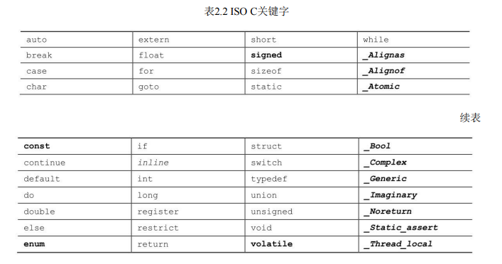
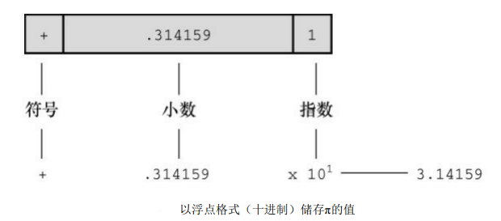
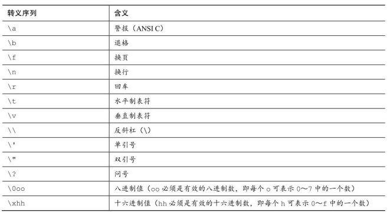

# C Primer Plus 6

## 1.初始 C 语言

**目标代码文件、可执行文件和库：**

C 编程的基本策略是，用程序把源代码文件转换为可执行文件（其中包含可直接运行的机器语言代码）。典型的 C 实现通过编译和链接两个步骤来完成这一过程。编译器把源代码转换成中间代码，链接器把中间代码和其他代码合并，生成可执行文件。C 使用这种分而治之的方法方便对程序进行模块化，可以独立编译单独的模块，稍后再用链接器合并已编译的模块。通过这种方式，如果只更改某个模块，不必因此重新编译其他模块。另外，链接器还将你编写的程序和预编译的库代码合并。


1. 对编程而言，可移植性意味着什么？

> 这意味着，在一种系统中编写的 C 程序稍作修改或不修改就能在其他系统运行

2. 解释源代码文件、目标代码文件和可执行文件有什么区别？

> 源代码文件： 一般指.c 文件，例如 main.c
> 目标代码文件：包含机器语言代码，它不是完整的程序代码。
> 可执行文件： 包含组成可执行程序的完整机器语言代码。

3. 编程的 7 个主要步骤是什么？

> 第 1 步：定义程序的目标
> 第 2 步：设计程序
> 第 3 步：编写代码
> 第 4 步：编译
> 第 5 步：运行程序
> 第 6 步：测试和调试程序
> 第 7 步：维护和修改代码

4. 编译器的任务是什么

> 编译器是把高级语言程序翻译成计算机能理解的机器语言指令集的程序。

5. 链接器的任务是什么？

> 链接器的作用是，把你编写的目标代码、系统的标准启动代码和库代码。这 3 部分合并成一个文件，即可执行文件。

## 2.C 语言概述

```cpp
#include <stdio.h> /* 指令和头文件，包含另一个文件 */
int main(void) /* 函数名 一个简单的C程序 */
{
	int num;				  /* 定义一个名为num的变量 */
	num = 1;				  /* 为num赋一个值 */
	printf("I am a simple "); /* 使用printf()函数 */
	printf("computer.\n");
	printf("My favorite number is %d because it is first.\n", num);
	return 0;
}
// I am a simple computer.
// My favorite number is 1 because it is first.
```

多个函数

```cpp
//* two_func.c -- 一个文件中包含两个函数 */
#include <stdio.h>
void butler(void); /* ANSI/ISO C函数原型 */
int main(void)
{
	printf("I will summon the butler function.\n");
	butler(); // 函数调用
	printf("Yes. Bring me some tea and writeable DVDs.\n");
	return 0;
}
void butler(void) /* 函数定义开始 */
{
	printf("You rang, sir?\n");
}
```

**关键字和保留字：**



| 最初K&R给出的关键字 | C90标准加的关键字 | C99标准添加的关键字 |
| ------------------- | ----------------- | ------------------- |
| int                 | signed            | _Bool               |
| long                | void              | _Complex            |
| short               |                   | _Imaginary          |
| unsigned            |                   |                     |
| char                |                   |                     |
| float               |                   |                     |
| double              |                   |                     |


## 3.数据和 C

```cpp
/* BIM.c */
#include <stdio.h>
int main(void)
{
	float height; /* 身高 */
	float weight; /* 体重 */
	printf("输入身高（米）\n");
	scanf("%f", &height);
	printf("输入体重（千克）\n");
	scanf("%f", &weight);
	float value = weight / height / height;
	printf("BMI 指数为 %.2f.\n", value);
	return 0;
}
```

### 整数


### 浮点数

计算机把浮点数分成小数部分和指数部分来表示，而且分开储存这两部分。



### C语言基本数据类型

#### int 类型

int类型是有符号整型，即int类型的值必须是整数，可以是正整数、负整数或零。
C规定int的取值范围最小为 -32768 ～ 32767。一般而言，系统用一个特殊位的值表示有符号整数的正负号。

```cpp
/* gold_value.c -- 黄金价格 */
#include <stdio.h>
int main(void)
{
	/* 浮点数类型（float）的变量 */
	float weight;
	float value;
	printf("你的黄金值吗？\n");
	printf("我们来看看。\n");
	printf("请以千克为单位输入你的黄金：");
	/* scanf()函数用于读取键盘的输入 */
	/* 。%f说明scanf()要读取用户从键盘输入的浮点数 */
	/* &weight告诉 scanf()把输入的值赋给名为 weight 的变量 */
	scanf("%f", &weight);
	value = 350 * weight * 1000;
	/* 在printf()中使用%f来处理浮点值，%.2f 显示小数点后面两位 */
	printf("你的黄金值 ￥%.2f.\n", value);
	return 0;
}
```

```cpp
#include <stdio.h>
int main(void)
{
	int ten = 10;
	int two = 2;
	printf("Doing it right: ");
	printf("%d minus %d is %d === > %d \n", ten, 2, ten - two, 1);
	printf("Doing it wrong: ");
	printf("%d minus %d is %d\n", ten); // 遗漏2个参数
	return 0;
}
```

八进制和十六进制

```cpp
/* bases.c--以十进制、八进制、十六进制打印十进制数100 */
#include <stdio.h>
int main(void)
{
	int x = 100;
	printf("dec = %d; octal = %o; hex = %x\n", x, x, x);
	printf("dec = %d; octal = %#o; hex = %#x\n", x, x, x);
	return 0;
}
```

#### 其他整数类型


- short int类型（或者简写为short）占用的存储空间可能比int类型少，常用于较小数值的场合以节省空间。与int类似，short是有符号类型。
- long int或long占用的存储空间可能比int多，适用于较大数值的场合。与 int类似，long是有符号类型。
- long long int或long long（C99标准加入）占用的储存空间可能比long多， 适用于更大数值的场合。该类型至少占64位。与int类似，long long是有符号类型。
- unsigned int或unsigned只用于非负值的场合。这种类型与有符号类型表 示的范围不同。例如，16位unsigned int允许的取值范围是0～65535，而不是-32768～32767。

2.使用多种整数类型的原因

因为C语言只规定了short占用的存储空间不能多于int，long占用的存储空间不能少于int。

C 标准对基本数据类型只规定了允许的最小大小。对于 16 位机，short和 int 的最小取值范围是[−32767,32767]；对于32位机，long的最小取值范围是[−2147483647,2147483647]。对于unsigned short和unsigned int，最小取值范围是[0,65535]；对于unsigned long，最小取值范围是[0,4294967295]。longlong类型是为了支持64位的需求，最小取值范围是[−9223372036854775807,9223372036854775807]；unsigned long long的最小取值范围是[0,18446744073709551615]。


```cpp
/* bases.c--以十进制、八进制、十六进制打印十进制数100 */
#include <stdio.h>
int main(void)
{
	int x = 100ULL;
	printf("dec = %d; octal = %o; hex = %x\n", x, x, x);
	printf("dec = %d; octal = %#o; hex = %#x\n", x, x, x);
	return 0;
}
```

1. 整数溢出

```cpp
/* toobig.c-- 超出系统允许的最大int值*/
#include <stdio.h>
int main(void)
{
	int i = 2147483647;
	unsigned int j = 4294967295;
	printf("%d %d %d\n", i, i + 1, i + 2); // 2147483647 -2147483648 -2147483647
	printf("%u %u %u\n", j, j + 1, j + 2); // 4294967295 0 1
	return 0;
}
```

当达到它能表示的最大值时，会重新从起始点开始。在超过最大值时，unsigned int 类型的变量 j 从 0开始；而int类型的变量i则从−2147483648开始。

2. 打印short、long、long long和unsigned类型

打印unsigned int类型的值，使用%u转换说明；

打印long类型的值，使 用%ld转换说明；

`%lx`表示以十六进制格式打印long类型整数；

`%lo`表示以八进制格式打印long类型整数；

`%hd`表示以十进制显示short类型的整数；

`%ho`表示以八进制显示short类型的整数；

`%lu`表示打印 unsigned long类型的值；

`%lld`和`%llu`分别表示有符号和无符号类型

`%d` 打印int类型的值

`%.2f` 保留2为的浮点数

`%ld` 打印long类型的值

`%u` 打印unsigned int类型的值

`&{value}` 地址符（输入内容）`scanf("%f",　&weight);`

注意，虽然C允许使用大写或小写的常量后缀，但是在转换说明中只能用小写。


打印 short、long、long long 和 unsigned 类型

```cpp
/* print2.c--更多printf()的特性 */
#include <stdio.h>
int main(void)
{
	unsigned int un = 3000000000; /* int为32位和short为16位的系统 */
	short end = 200;
	long big = 65537;
	long long verybig = 12345678908642;
	/* 
		int --- 4 byte = 32bit %ul
		short --- 2 byte = 12bit %ul
		long --- 8 byte = 64bit %ld
		long long --- 8 byte = 64bit %ld
	 */
	printf("int size = %d\n", sizeof(int));
	printf("un = %u and not %d\n", un, un);
	printf("end = %hd and %d\n", end, end);
	printf("big = %ld and not %hd\n", big, big);
	printf("verybig= %lld and not %ld\n", verybig, verybig);
	return 0;
}
// 以十进制显示数字，使用%d
// 以八进制显示数字，使用%o
// 以十六进制显示数字，使用%x
// 要显示各进制数的前缀0、0x和0X，必须分别使用%#o、%#x、%#X
```

### 使用字符：char

char类型用于储存字符（如，字母或标点符号），但是从技术层面看，char是整数类型。
实际上，字符是以数值形式储存的，所以也可使用数字代码值来赋值：

```cpp
#include <stdio.h>
int main(void)
{
	char grade = 'A';
	// char grade = 65;

	printf("grade = %c\n", grade);
	printf("grade = %d\n", grade);
	return 0;
}
```

非打印字符

```cpp
#include <stdio.h>
int main(void)
{
	// 1. 使用ASCII码
	char beep = 7;
	// 2. 使用特殊的符号序列表示一些特殊的字符
	char nerf = '\n';
	printf("beep = %c\n", beep);
	printf("beep = %d\n", beep);

	printf("nerf = %c\n", nerf);
	printf("nerf = %d\n", nerf);
	return 0;
}
```



```cpp
/* charcode.c-显示字符的代码编号 */
#include <stdio.h>
int main(void)
{
	char ch;
	printf("用户输入字符\n");
	scanf("%c", &ch); /* 用户输入字符 */
	printf("显示字符的代码编号 char: %c  int: %d.\n", ch, ch);
	return 0;
}
```

char 是有符号还是无符号?

有些C编译器把char实现为有符号类型，这意味着char可表示的范围是-128～127。而有些C编译器把char实现为无符号类型，那么char可表示的范围是0～255。

### float、double和long double

C语言中的浮点类型有float、double和long double类型。
浮点数的表示类似于科学记数法（即用小数乘以10的幂来表示数字）。


C标准规定，float类型必须至少能表示6位有效数字，且取值范围至少是 10^-37～10^+37。前一项规定指float类型必须至少精确表示小数点后的6位有效数字，如33.333333。后一项规定用于方便地表示诸如太阳质量（2.0e30千克）、一个质子的电荷量（1.6e-19库仑）或国家债务之类的数字。通常，系统储存一个浮点数要占用32位。其中8位用于表示指数的值和符号，剩下24位用于表示非指数部分（也叫作尾数或有效数）及其符号。

C语言提供的另一种浮点类型是double（意为双精度）。double类型和float类型的最小取值范围相同，但至少必须能表示10位有效数字。一般情况下，double占用64位而不是32位。一些系统将多出的 32 位全部用来表示非指数部分，这不仅增加了有效数字的位数（即提高了精度），而且还减少了舍入误差。另一些系统把其中的一些位分配给指数部分，以容纳更大的指数，从而增加了可表示数的范围。无论哪种方法，double类型的值至少有13位有效数字，超过了标准的最低位数规定。

```cpp
#include <stdio.h>
int main(void)
{
	printf("%d\n", sizeof(float)); // 4
	printf("%d\n", sizeof(double)); // 8
	printf("%d\n", sizeof(long double)); // 12
	return 0;
}
```

C语言的第3种浮点类型是long double，以满足比double类型更高的精度要求。不过，C只保证long double类型至少与double类型的精度相同。

默认情况下，编译器假定浮点型常量是double类型的精度。例如，假设some是float类型的变量，编写下面的语句：

```cpp
/* charcode.c-显示字符的代码编号 */
#include <stdio.h>
int main(void)
{
	/* 通常，4.0和2.0被储存为64位的double类型，使用双精度进行乘法运
	算，然后将乘积截断成float类型的宽度。这样做虽然计算精度更高，但是会
	减慢程序的运行速度。
	*/
	float some = 4.0 * 2.0;
	return 0;
}
```

在浮点数后面加上f或F后缀可覆盖默认设置，编译器会将浮点型常量看作float类型，如2.3f和9.11E9F。使用l或L后缀使得数字成为long double类型，如54.3l和4.32L。没有后缀的浮点型常量是double类型。

**打印浮点值**

printf()函数使用%f转换说明打印十进制记数法的float和double类型浮点数，用%e打印指数记数法的浮点数。
如果系统支持十六进制格式的浮点数，可用a和A分别代替e和E。打印long double类型要使用%Lf、%Le或%La转换说明。

```cpp
/* charcode.c-显示字符的代码编号 */
#include <stdio.h>
int main(void)
{
	float aboat = 32000.0;
	double abet = 2.14e9;
	long double dip = 5.32e-5;
	printf("标准浮点型：%f 可以写成e的记数法： %e\n", aboat, aboat);
	// 下一行要求编译器支持C99或其中的相关特性
	printf("十六进制格式： %a \n", aboat);
	printf("标准浮点型：%f 可以写成e的记数法： %e\n", abet, abet);
	printf("标准浮点型：%Lf 可以写成e的记数法： %Le\n", dip, dip);
	return 0;
}
```

**浮点值的上溢和下溢**

```cpp
/* 假设系统的最大float类型值是3.4E38 */
#include <stdio.h>
int main(void)
{
	float toobig = 3.4E38 * 100.0f;
	printf("%e\n", toobig); // 1.#INF00e+000
	/* 这是一个上溢（overflow）的示例。当计算导致数字过大，超过当前类型能表达的范围时，就会发生上溢。 */
	return 0;
}
```

**浮点数舍入错误：**

```cpp
/* 假设系统的最大float类型值是3.4E38 */
#include <stdio.h>
int main(void)
{
	float a, b;
	b = 2.0e20 + 1.0;
	a = b - 2.0e20;
	printf("%f \n", a);
	return 0;
}
```

得出这些奇怪答案的原因是，计算机缺少足够的小数位来完成正确的运算。2.0e20是 2后面有20个0。如果把该数加1，那么发生变化的是第21位。要正确运算，程序至少要储存21位数字。而float类型的数字通常只能储存按指数比例缩小或放大的6或7位有效数字。在这种情况下，计算结果一定是错误的。另一方面，如果把2.0e20改成2.0e4，计算结果就没问题。因为2.0e4加1只需改变第5位上的数字，float类型的精度足够进行这样的计算。


### 其他类型

C语言还有一些从基本类型衍生的其他类型，包括数组、指针、结构和联合。

小结：基本数据类型

关键字：

基本数据类型由11个关键字组成：int、long、short、unsigned、char、float、double、signed、_Bool、_Complex和_Imaginary。

1. 有符号整型：

有符号整型可用于表示正整数和负整数。

int ——系统给定的基本整数类型。C语言规定int类型不小于16位。

short或short int ——最大的short类型整数小于或等于最大的int类型整数。C语言规定short类型至少占16位。

long或long int ——该类型可表示的整数大于或等于最大的int类型整数。C语言规定long类型至少占32位。

long long或long long int ——该类型可表示的整数大于或等于最大的long类型整数。Long long类型至少占64位。

2. 无符号整型：

无符号整型只能用于表示零和正整数，因此无符号整型可表示的正整数比有符号整型的大。在整型类型前加上关键字unsigned表明该类型是无符号整型：unsignedint、unsigned long、unsigned short。单独的unsigned相当于unsigned int。

3. 字符类型：

可打印出来的符号（如A、&和+）都是字符。

char ——字符类型的关键字。有些编译器使用有符号的char，而有些则使用无符号的char。在需要时，可在char前面加上关键字signed或unsigned来指明具体使用哪一种类型。

4. 布尔类型：

布尔值表示true和false。C语言用1表示true，0表示false。

_Bool ——布尔类型的关键字。布尔类型是无符号 int类型，所占用的空间只要能储存0或1即可。

5. 实浮点类型：

实浮点类型可表示正浮点数和负浮点数。

float ——系统的基本浮点类型，可精确表示至少6位有效数字。

double ——储存浮点数的范围（可能）更大，能表示比 float 类型更多的有效数字（至少 10位，通常会更多）和更大的指数。

long long ——储存浮点数的范围（可能）比double更大，能表示比double更多的有效数字和更大的指数。

6. 复数和虚数浮点数：

虚数类型是可选的类型。复数的实部和虚部类型都基于实浮点类型来构成：

float _Complex
double _Complex
long double _Complex
float _Imaginary
double _Imaginary
long long _Imaginary

### 类型大小

```cpp
//* typesize.c -- 打印类型大小 */
#include <stdio.h>
int main(void)
{
	/* C99为类型大小提供%zd转换说明 */
	printf("类型 char 的大小 %zd bytes.\n", sizeof(char));
	printf("类型 short 的大小 %zd bytes.\n", sizeof(short));
	printf("类型 int 的大小 %zd bytes.\n", sizeof(int));
	printf("类型 long 的大小 %zd bytes.\n", sizeof(long));
	printf("类型 long long 的大小 %zd bytes.\n", sizeof(long long));
	printf("类型 float 的大小 %zd bytes.\n", sizeof(float));
	printf("类型 double 的大小 %zd bytes.\n", sizeof(double));
	printf("类型 long double 的大小 %zd bytes.\n", sizeof(long double));
	return 0;
}
```

C99和C11提供%zd转换说明匹配sizeof的返回类型。一些不支持C99和C11的编译器可用%u或%lu代替%zd。
