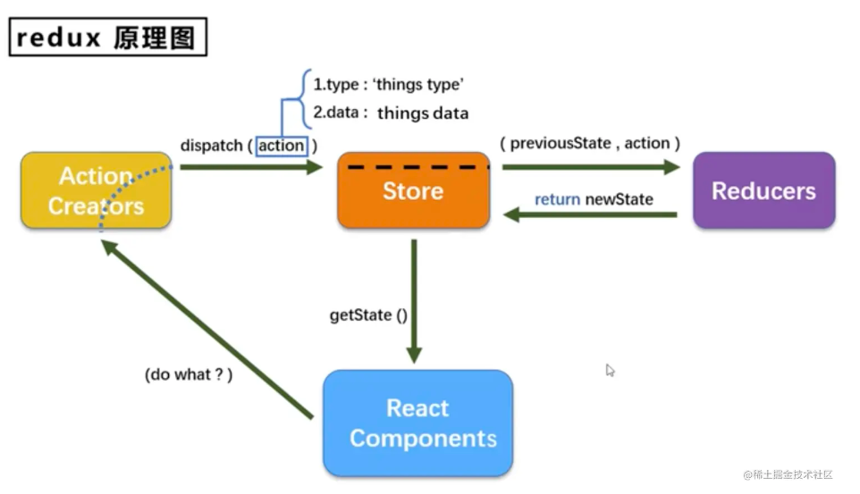

## 简述

### 什么是 Redux？

**Redux** 是一个用于 JavaScript 应用的状态管理库，通常与 React 或 Vue 等前端框架一起使用。它帮助你以一种可预测的方式管理应用状态，并且提供了强大的开发工具支持（如 Redux DevTools）。Redux 的核心思想是：

- **单一数据源**：整个应用的状态存储在一个称为 store 的对象中。
- **状态是只读的**：唯一改变状态的方法是触发一个 action（动作），action 是一个描述发生了什么的对象。
- **使用纯函数来执行修改**：为了指定如何根据 action 更新状态，你需要编写 reducers（纯函数），它们接收旧的状态和 action，然后返回新的状态。

### 核心概念

1. **Action**：描述发生了什么，是一个普通的对象，必须包含 `type` 字段。
2. **Reducer**：定义了 state 如何响应不同的 actions。它是一个纯函数，接受旧的 state 和 action，返回新的 state。
3. **Store**：保存着应用的状态树。可以通过 `getState()` 获取状态、通过 `dispatch(action)` 触发状态更新、通过 `subscribe(listener)` 设置监听器。

---

## Redux Demo 示例

### 步骤 1: 安装依赖

首先，确保你的项目已经安装了 Redux 和 React-Redux（如果与 React 结合使用）。

```bash
npm install redux react-redux
```

### 步骤 2: 创建 Actions

创建一个文件 `actions/userActions.js`，定义用户相关的动作。

```js
export const login = userData => ({
  type: 'LOGIN',
  payload: userData
});

export const logout = () => ({
  type: 'LOGOUT'
});
```

创建一个文件 `actions/counterActions.js`，定义增加和减少计数的动作。

```js
export const increment = (value = 1) => ({
  type: 'INCREMENT',
  payload: value, // 携带自定义增量
});

export const decrement = (value = 1) => ({
  type: 'DECREMENT',
  payload: value, // 携带自定义减量
});
```

### 步骤 3: 创建 Reducer

创建一个文件 `userReducer.js`。

```js
const initialState = {
  name: '',
  isLoggedIn: false,
};

export default function userReducer(state = initialState, action) {
  switch (action.type) {
    case 'LOGIN':
      return { ...state, name: action.payload.name, isLoggedIn: true };
    case 'LOGOUT':
      return { ...state, name: '', isLoggedIn: false };
    default:
      return state;
  }
}
````

创建一个文件 `counterReducer.js`，定义如何处理这些动作。

```js
const initialState = {
  count: 0
};

function counterReducer(state = initialState, action) {
  switch (action.type) {
    case 'INCREMENT':
      return { ...state, count: state.count + action.payload };
    case 'DECREMENT':
      return { ...state, count: state.count - action.payload };
    default:
      return state;
  }
}

export default counterReducer;
```

用 combineReducers 合并它们 `rootReducer.js`:

```js
import { combineReducers } from 'redux';
import userReducer from './userReducer';
import counterReducer from './counterReducer';

const rootReducer = combineReducers({
  user: userReducer, // store.user
  counter: counterReducer // store.counter
});

export default rootReducer;
```

### 步骤 4: 配置 Store

在 `store.js` 中配置 Redux store。

```js
import { createStore } from 'redux';
import rootReducer from './rootReducer';

const store = createStore(rootReducer);

export default store;
```

### 步骤 5: 将 Redux 连接到 React 组件

在 `index.js` 或主组件文件中连接 Redux。

```jsx
import React from 'react';
import ReactDOM from 'react-dom';
import { Provider } from 'react-redux';
import App from './App'; // 假设这是你的根组件
import store from './store';

ReactDOM.render(
  <Provider store={store}>
    <App />
  </Provider>,
  document.getElementById('root')
);
```

### 步骤 6: 在组件中使用 Redux

最后，在 `App.js` 中展示并操作计数器。

```jsx
import React from 'react';
import { useSelector, useDispatch } from 'react-redux';
import { increment, decrement } from './actions/counterActions';
import { login, logout } from './actions/userActions';

function App() {
  const count = useSelector(state => state.count);
  const { name, isLoggedIn } = useSelector(state => state.user);
  const dispatch = useDispatch();

  return (
    <div style={{ padding: '20px', fontSize: '18px' }}>
      <h1>Count: {count}</h1>

      {/* 固定值操作 */}
      <button onClick={() => dispatch(increment())}>+1</button>
      <button onClick={() => dispatch(decrement())}>-1</button>

      {/* 自定义值操作 */}
      <br />
      <br />
      <button onClick={() => dispatch(increment(5))}>+5</button>
      <button onClick={() => dispatch(decrement(3))}>-3</button>

      {/* 动态输入 */}
      <br />
      <br />
      <input
        type='number'
        defaultValue={1}
        id='step'
        style={{ width: '60px', marginRight: '10px' }}
      />
      <button
        onClick={() => {
          const step = Number(document.getElementById('step').value) || 1;
          dispatch(increment(step));
        }}
      >
        Add Custom
      </button>

      <h1>User: {name || 'Guest'}</h1>
      {isLoggedIn ? <button onClick={() => dispatch(logout())}>Logout</button> : <button onClick={() => dispatch(login({ name: 'Alice' }))}>Login</button>}
    </div>
  );
}

export default App;
```
